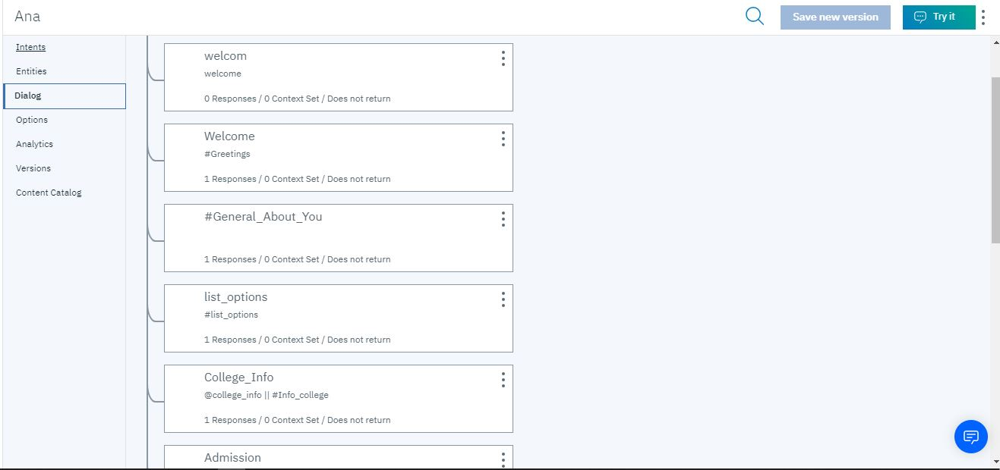
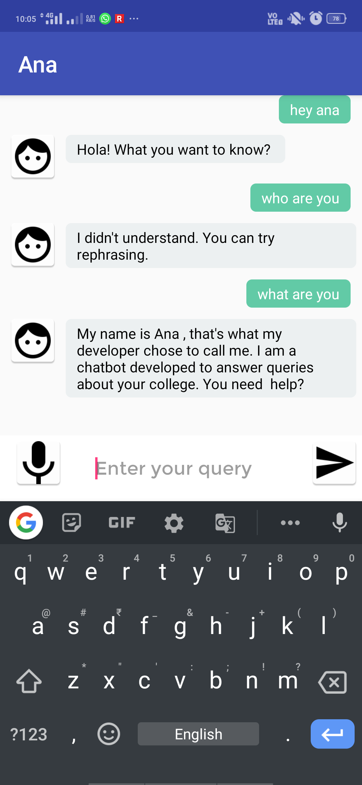
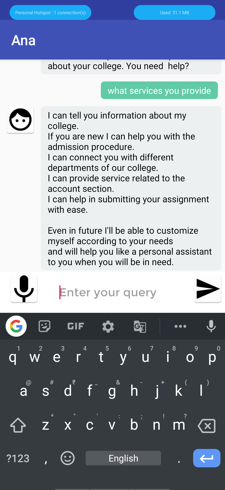
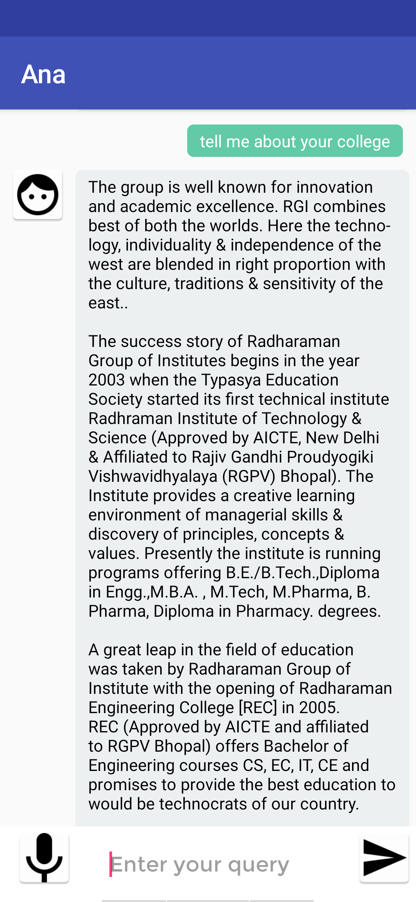
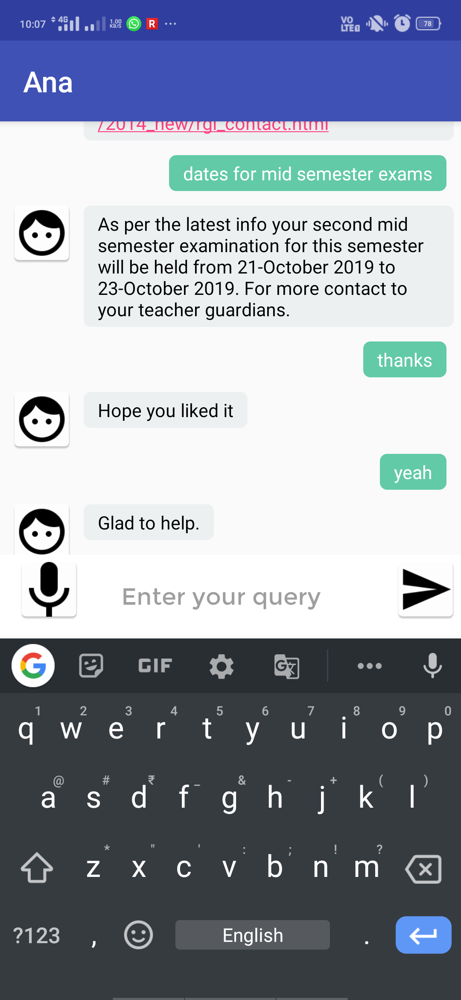

# Ana-CollegeEnquiryBot: A voice-enabled Android ChatBot powered by IBM Watson
Ana is a chatbot developed on IBM's AI platform Watson.

It consist IBM watson assistant services.
Speec-to-text and Text-to-speech services also from IBM Watson.

# Designing of Conversation Flow:

# Screenshots of the android application:

  
  
  
  

